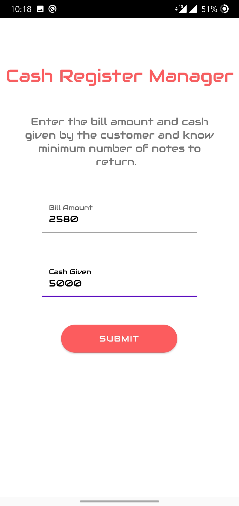
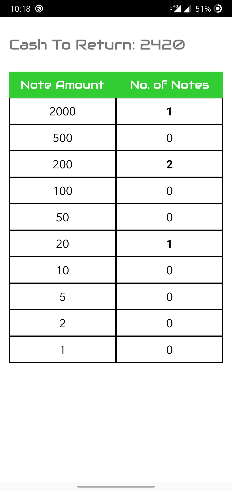

## Project Idea 💡 🌟

This project consist of creating an Android App that will tell you how much cash you need to take from the cashier after giving them money...

This project will give you detailed summary of how much amount you need to take...

### Features

* Responsive Design
* Project is build in Kotlin

